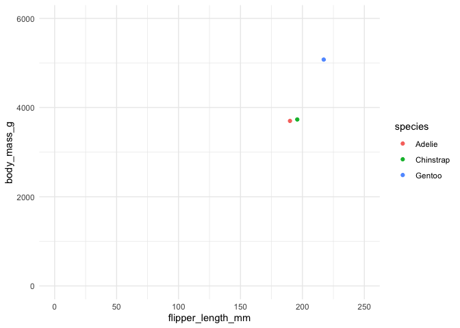

Assignment B-1: Making a function
================
Jaden L. Phillips
2022-11-01

## Tidy Submission (15 points)

Follow these steps to submit your work. Be sure to familiarize yourself
with the rubric for a tidy submission below, before doing these steps.

1.  Make a README file for your repository. It should be a brief
    document letting a visitor know what’s in this repository (at a high
    level) and some key things they should know about how to use the
    files in the repository.
2.  Tag a release in your GitHub repository corresponding to your
    submission before the deadline.
3.  Grab the URL corresponding to your tagged release, and submit that
    to canvas.

Loading directory with packages needed to run the code for this
Assignment:

``` r
library(tidyverse)
library(dplyr)
library(ggplot2)
library(testthat)
library(palmerpenguins)
library(gapminder)
```

## Exercise 1: Make a Function (25 points)

In this exercise, you’ll be making a function and fortifying it. The
function need not be complicated. The function need not be “serious”,
but shouldn’t be nonsense.  

**Function Ideas**

- Did you repeat any code for a data analysis in STAT 545A? If so,
  consider making a function for this action.
- Consider bundling a specific group_by() %\>% summarise() workflow.
- Write a wrapper around an existing function.
  - For example, perhaps accepting a narrower range of inputs (like not
    allowing logical vectors), or providing a different output.
  - A specific example: my rqdist() function is a wrapper around
    quantreg::rq(), narrowing its functionality.
  - It’s usually better to narrow a function’s focus than to broaden, so
    that a function doesn’t end up doing too much.
- Make a function extracting parts of an “lm” object that you can’t
  easily access (broom aside), or measuring the “difference” between a
  linear and quadratic fit.
- Make a special plot that you’d want to repeat when exploring your
  data.
- …

``` r
avg_cols_group <- function(.data, y, na.rm = FALSE, ...) {
  .data %>%
     group_by({{y}}, {{...}}) %>% 
     summarise(across(where(is.numeric), mean, na.rm = TRUE))
}
```

## Exercise 2: Document your Function (20 points)

In the same code chunk where you made your function, document the
function using roxygen2 tags. Be sure to include:

1.  Title.
2.  Function description: In 1-2 brief sentences, describe what the
    function does.
3.  Document each argument with the @param tag, making sure to justify
    why you named the parameter as you did.
    - (Justification for naming is not often needed, but we want to hear
      your reasoning.)
4.  What the function returns, using the @return tag.

``` r
#' Column Averages per Group (avg_cols_group)
#' 
#' This function first identifies a grouping variable (taken as *categorical*). Inspecting across all columns of the data frame, this function then selects all of the numeric columns and calculates the means of each of those numeric columns for each group (i.e., level of the grouping variable, corresponding to particular rows).
#'
#' @param .data the data frame or data frame extension (e.g. tibble). We opted for the function name ".data" to avoid name collision with the `data()` function in base R packages.
#' @param y     the variable to group by. This is interpreted as a categorical variable. If left unspecified, the function will still work, though will simply be computing means of all rows since no grouping parameter was specified.
#' @param na.rm a logical value (TRUE / FALSE) indicating whether NA values should be stripped before the computation proceeds. If `FALSE` (the default), the result will be `NA` if any element of `y` or another grouping variable is `NA`.
#' @param ...   the optional, additional, variable(s) to group by.
#'
#' @return Returns a data frame containing to the average value of each numeric column per level of the grouping variable (if there is one, or more). With the exception of column names as the top row of the dataframe, each subsequent row of the dataframe corresponds to a grouping 'level', and contains the means -- for that level -- of all the numeric variables in the dataset.

avg_cols_group <- function(.data, y, na.rm = FALSE, ...) {
  .data %>%
     group_by({{y}}, {{...}}) %>% 
     summarise(across(where(is.numeric), mean, na.rm = TRUE))
}
```

## Exercise 3: Include examples (15 points)

Demonstrate the usage of your function with a few examples. Use one or
more new code chunks, describing what you’re doing.

Note: If you want to deliberately show an error, you can use error =
TRUE in your code chunk option.

#### Example 1: **mtcars** dataset

In this example we are looking at the mtcars dataset from the base R
`datasets` package:  

- We are interested in learning about how the various vehicle specs
  compare across cars with different \# of cylinders.

- Here, we can utilize the avg_cols_group( ) function, and select ‘cyl’
  as the categorical variable to group by.

- The output returns a tibble with one row corresponding to the average
  values across each variable for each 4, 6, and 8 cylinders. cars.

``` r
avg_cols_group(.data = mtcars, y = cyl, na.rm = TRUE)
```

    ## # A tibble: 3 × 11
    ##     cyl   mpg  disp    hp  drat    wt  qsec    vs    am  gear  carb
    ##   <dbl> <dbl> <dbl> <dbl> <dbl> <dbl> <dbl> <dbl> <dbl> <dbl> <dbl>
    ## 1     4  26.7  105.  82.6  4.07  2.29  19.1 0.909 0.727  4.09  1.55
    ## 2     6  19.7  183. 122.   3.59  3.12  18.0 0.571 0.429  3.86  3.43
    ## 3     8  15.1  353. 209.   3.23  4.00  16.8 0     0.143  3.29  3.5

#### Example 2: **gapminder** dataset

In this example we are looking at the gapminder dataset, which is an
excerpt of the `gapminder` data on life expectancy, GDP per-capita, and
population by country:

- We are interested in comparing the various numeric variables across
  countries

- Using the avg_cols_group( ) function, we can achieve this in one step:

  - Indicate to group by the column y = `country`, which then computes
    the averages across all columns for rows corresponding to each
    country, which turns out to be across all years in the dataset.

  - This returns a much tidier, smaller tibble with just **a single row
    corresponding to each country**, including the mean of (not relevant
    but computed because it is numeric:) year, life expectancy,
    population, and GDP per-capita across all years in the dataset.

``` r
avg_cols_group(.data = gapminder, y = country, na.rm = TRUE)
```

    ## # A tibble: 142 × 5
    ##    country      year lifeExp       pop gdpPercap
    ##    <fct>       <dbl>   <dbl>     <dbl>     <dbl>
    ##  1 Afghanistan 1980.    37.5 15823715.      803.
    ##  2 Albania     1980.    68.4  2580249.     3255.
    ##  3 Algeria     1980.    59.0 19875406.     4426.
    ##  4 Angola      1980.    37.9  7309390.     3607.
    ##  5 Argentina   1980.    69.1 28602240.     8956.
    ##  6 Australia   1980.    74.7 14649312.    19981.
    ##  7 Austria     1980.    73.1  7583298.    20412.
    ##  8 Bahrain     1980.    65.6   373913.    18078.
    ##  9 Bangladesh  1980.    49.8 90755395.      818.
    ## 10 Belgium     1980.    73.6  9725119.    19901.
    ## # … with 132 more rows

#### Example 3: **penguins** dataset

By applying the avg_group_var( ) function to the penguins dataset, and
indicating to the function to group by the `species`variable:

- This returns an output tibble with 3 rows corresponding to the 3
  penguin species in the original penguins dataset: Adelie, Chinstrap,
  and Gentoo.

- Each row also contains the mean value of all numeric variables
  corresponding to penguins of that species.

The subsequent code uses this function in creating a scatter-plot of the
flipper length v.s. body mass of the average sized penguins of each
species (with average body mass & flipper length). This plot is not that
interesting but a similar plot could be useful if more groups are
involved in your dataset.

``` r
avg_cols_group(.data = penguins, y = species, na.rm = TRUE) 
```

    ## # A tibble: 3 × 6
    ##   species   bill_length_mm bill_depth_mm flipper_length_mm body_mass_g  year
    ##   <fct>              <dbl>         <dbl>             <dbl>       <dbl> <dbl>
    ## 1 Adelie              38.8          18.3              190.       3701. 2008.
    ## 2 Chinstrap           48.8          18.4              196.       3733. 2008.
    ## 3 Gentoo              47.5          15.0              217.       5076. 2008.

``` r
avg_cols_group(.data = penguins, y = species, na.rm = TRUE) %>%
  ggplot(aes(x = flipper_length_mm, y = body_mass_g, colour = species)) +
    geom_point() +
    theme_minimal() +
    xlim(0, 250) +
    ylim(0, 6000)
```

<!-- -->

## Exercise 4: Test the Function (25 points)

Running examples is a good way of checking by-eye whether your function
is working as expected. But, having a formal “yes or no” check is useful
when you move on to other parts of your analysis.

Write formal tests for your function. You should use at least three
non-redundant uses of an expect\_() function from the testthat package,
and they should be contained in a test_that() function (or more than
one). They should all pass.

Example of non-redundant inputs:

- Vector with no NA’s
- Vector that has NA’s
- Vector of a different type (if relevant)
- Vector of length 0, like numeric(0).

Example of redundant inputs:

- Providing a different number (unless one of these numbers have some
  significance, like a limit point – just tell us if that’s the case)
